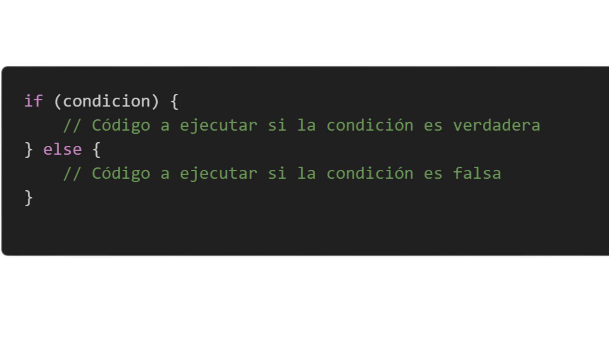
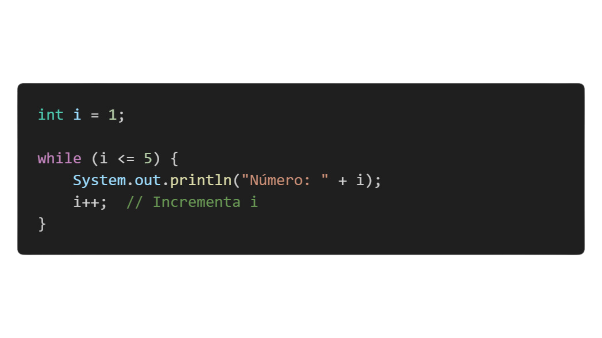
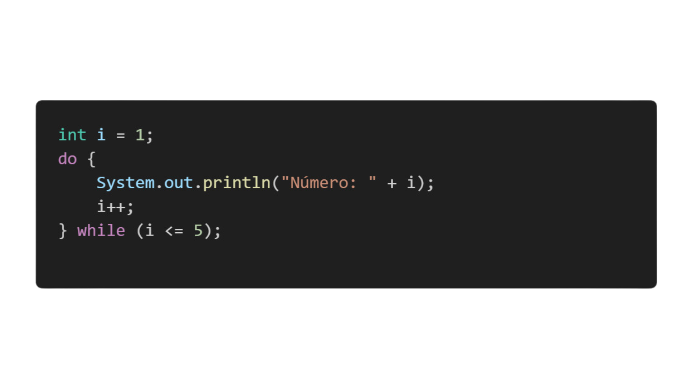

# **1. Bucles en Java**

## **Definición de Bucles**

Los bucles permiten ejecutar un bloque de código repetidamente mientras una condición sea verdadera o durante un número determinado de veces.

## **Sintaxis básica de bucle for:**

El bucle for se utiliza cuando sabes de antemano cuántas veces quieres repetir un bloque de código. Tiene tres partes:

* **Inicialización:** define el valor inicial de la variable de control.
* **Condición:** mientras esta condición sea verdadera, el bucle continuará.
* **Incremento/Decremento:** modifica la variable de control al final de cada iteración.

## **Estructura while**

El bucle while repite un bloque de código mientras la condición sea verdadera. Se evalúa la condición antes de ejecutar el código.

## **Explicacion del codigo**
* El bucle se ejecuta mientras la condición i <= 5 sea verdadera.

* Al final de cada iteración, i se incrementa con i++ para avanzar hacia la condición de salida.

## **Estructura do while**

El bucle do-while es similar al while, pero con una diferencia clave: siempre ejecuta el bloque de código al menos una vez. Esto se debe a que la condición se evalúa después de ejecutar el código.

