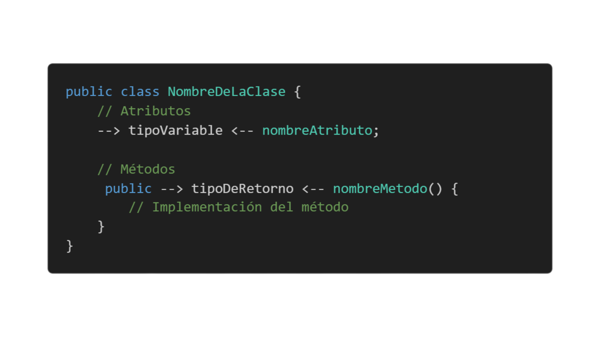

# **1. Clases y objetos en Java**

## **Definición de Clase**
Una **clase** es una plantilla  que describe las propiedades (atributos) y comportamientos (métodos) de los objetos que se crearán a partir de ella. En términos de programación orientada a objetos, una clase define la estructura y comportamiento de futuros objetos.

## **Sintaxis básica de una clase:**

### **Atributos:** Variables que pertenecen a la clase y describen las características de los objetos creados a partir de ella. En este caso, nombre es de tipo String y edad es de tipo int.

### **Métodos:** Son funciones o comportamientos que definen las acciones que un objeto de esa clase puede realizar. Aquí, el método detalles() imprime los atributos del objeto.
### **Visibilidad:** El uso de public en Java indica que tanto la clase como sus métodos y atributos son accesibles desde cualquier otra clase.

## **¿Qué es un objeto?**

Un **objeto** es una copia específica de una clase. Si la clase es un molde, entonces los objetos son los productos hechos con ese molde. Para crear un objeto, usamos la palabra clave new, que crea una "instancia" de esa clase.

## **Sintaxis básica de un objeto:**

## **Explicacion del codigo**

### **Persona persona1 = new Persona();** crea un nuevo objeto de tipo Persona.
### A través de **persona1.nombre = "Juan";** estamos asignando el valor "Juan" al atributo nombre del objeto persona1.
### Finalmente, llamamos al método **detalles()** de persona1 para que imprima sus atributos.

