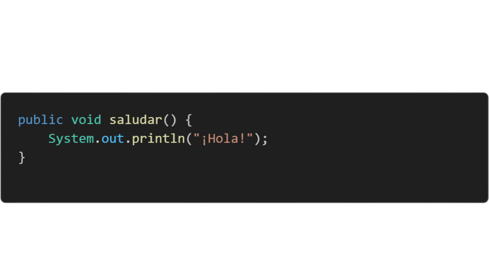

#  1. **Métodos en Java**

## **Definición de metodos**
Un **método** en Java es una función definida dentro de una clase que describe una acción que un objeto puede realizar. Los métodos pueden **devolver valores** (definidos con un tipo de retorno) o ser del tipo void, lo que significa que **no devuelven ningún valor.**

## **Sintaxis básica de un metodo**

## **Método con retorno**  

## **Explicacion del codigo**

Se devuelve el valor de la suma de a + b al metodo **sumar**, es decir si imprimimos el metodo sumar en main me dara el resultado de la suma
## **Método void (sin retorno)** 

