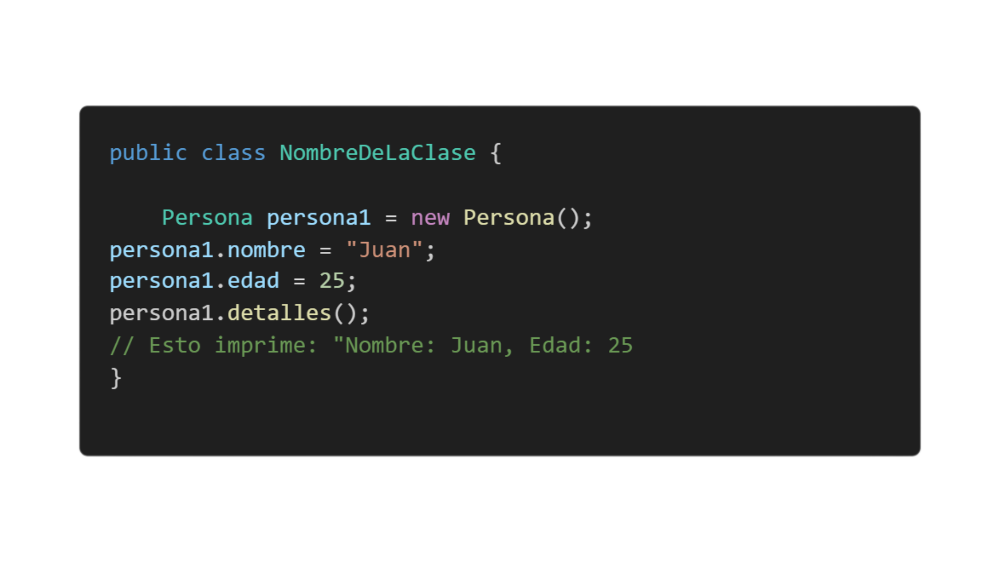

# **1. Instancia de una clase (Objeto)**

## **Definición de objeto**

Un **objeto** es una copia específica de una clase. Si la clase es un molde, entonces los objetos son los productos hechos con ese molde. Para crear un objeto, usamos la palabra clave new, que crea una "instancia" de esa clase.

## **Sintaxis básica de un objeto:**

## **Explicacion del codigo**

### **Persona persona1 = new Persona();** crea un nuevo objeto de tipo Persona.
### A través de **persona1.nombre = "Juan";** estamos asignando el valor "Juan" al atributo nombre del objeto persona1.
### Finalmente, llamamos al método **detalles()** de persona1 para que imprima sus atributos.

