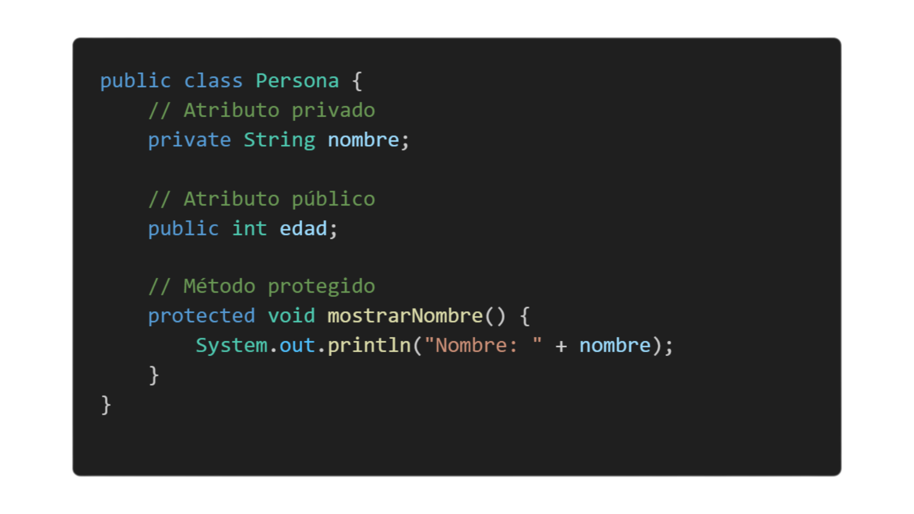

# **1. Visibilidad**
## **Definición de Visiblidad**

**Los modificadores de visibilidad** controlan quién puede acceder a las clases, métodos y atributos. En Java, hay tres niveles principales de visibilidad:

* **Public:** El atributo o método es accesible desde cualquier lugar, incluso desde otras clases.

* **Private:** Solo se puede acceder a ese atributo o método dentro de la misma clase. Nadie fuera de esa clase puede verlo o modificarlo directamente.

* **protected:** Permite que las subclases (clases que heredan de esta) y las clases dentro del mismo paquete puedan acceder a esos atributos o métodos.

## **Sintaxis básica de un objeto:**

## **Explicacion del codigo**

* **nombre** es privado, por lo que solo se puede acceder a él desde dentro de la clase Persona.

* **edad** es público, por lo que cualquier otra clase puede acceder y modificar este valor.

* **mostrarNombre()** es un método protegido, lo que significa que puede ser llamado desde subclases o clases del mismo paquete.