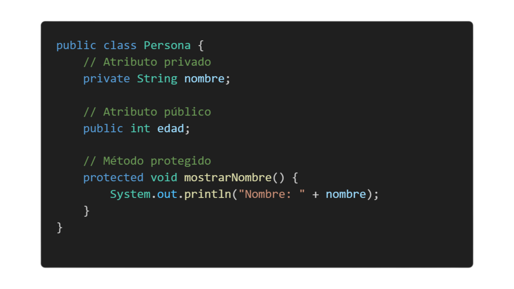

#  1. **Constructores en Java**

## **Definición de contructores**

Un constructor es un método especial de una clase que se ejecuta automáticamente cuando se crea un objeto. Su función es inicializar los atributos del objeto.

## **Definición de contructores**

En Java, un constructor tiene el mismo nombre que la clase y no tiene tipo de retorno (ni siquiera void). Se usa para asignar valores iniciales a los atributos de un objeto.

## **Definición de contructores**

Constructor sin parámetros: No recibe valores y puede inicializar atributos con valores predeterminados.

